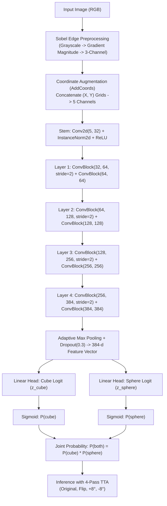

# Deep Learning: Kaggle Binary Image Classification Challenge

[](https://www.kaggle.com/competitions/iith-deep-learning-2026-hackathon)
[](https://www.python.org/downloads/)
[](https://pytorch.org/)
[](LICENSE)
[]()

This repository contains the complete deep learning codebase, modular package architecture, automated data acquisition tools, and experimentation findings developed for the [**IITH Deep Learning 2026 Hackathon**](https://www.kaggle.com/competitions/iith-deep-learning-2026-hackathon) hosted on Kaggle.

---

## Competition & Dataset Link

* **Official Kaggle Competition Page**: [https://www.kaggle.com/competitions/iith-deep-learning-2026-hackathon](https://www.kaggle.com/competitions/iith-deep-learning-2026-hackathon)
* **Leaderboard & Submissions**: Accessible directly via the above competition URL.

---

## Problem Statement & Task

The challenge requires classifying synthetic 3D rendered scenes into one of two categories:
* **Class 0 — Negative**: The scene does not contain both a cube and a sphere.
* **Class 1 — Positive**: The scene contains **at least one cube AND at least one sphere**.

Model performance is evaluated on classification accuracy over a held-out test set of 5,010 unlabelled images.

### Dataset Specifications

The dataset consists of multi-object synthetic scenes (inspired by CLEVR and ClevrTex):
* **Object Count**: Every image contains exactly **four objects**.
* **Geometric Primitives**: Objects belong to one of three shape categories: `cube`, `sphere`, or `cylinder`.
* **Surface Materials**: Objects have either `matte` or `metallic` (specular) reflectance.
* **Size Variations**: Non-uniform scaling; objects vary in size within each scene.
* **Occlusions**: Objects can partially occlude one another depending on camera perspective.

| Split | Class 0 (Negative) | Class 1 (Positive) | Total Images | Status |
| :--- | :---: | :---: | :---: | :--- |
| **Train** | 9,000 | 9,000 | 18,000 | Labelled; Perfectly balanced |
| **Public Test** | — | — | 5,010 | Unlabelled |

> [!IMPORTANT]
> **Ground-Truth Classification Rule (Discovered during EDA)**:
> Rather than classifying arbitrary texture or background features, Class 1 is strictly governed by the joint condition:
> $$\text{Class} = 1 \iff N_{\text{cube}} \ge 1 \ \land \ N_{\text{sphere}} \ge 1$$
> Class 0 scenes fail this condition (e.g., scenes with only cubes, only spheres, cylinders only, or neither).

---

## Dataset Access & Automated Downloader

You can download the dataset directly from the official competition page or use our integrated automated downloader.

### Method 1: Automated Downloader Script (`download_data.py`)
Ensure your Kaggle API key is placed at `~/.kaggle/kaggle.json` (or set `KAGGLE_USERNAME` and `KAGGLE_KEY` environment variables):
```bash
# Download and automatically unzip into ./data/
python download_data.py --output-dir ./data
```

### Method 2: Kaggle CLI
You can also fetch the dataset using the standard Kaggle CLI:
```bash
kaggle competitions download -c iith-deep-learning-2026-hackathon -p ./data
unzip ./data/iith-deep-learning-2026-hackathon.zip -d ./data
```

### Method 3: Python API
```python
from src import download_kaggle_dataset

# Automatically authenticates, downloads, and unzips
download_kaggle_dataset(output_dir="./data")
```

### Method 4: Manual Web Download
Navigate to the [IITH Deep Learning 2026 Hackathon Data Tab](https://www.kaggle.com/competitions/iith-deep-learning-2026-hackathon/data), click **Download All**, and extract the zip archive so the files match:
```
data/
├── train/
│   ├── 0/       # 9,000 images
│   └── 1/       # 9,000 images
└── test/        # 5,010 unlabelled images
```

---

## Experimental Progression & Benchmark Comparison

We benchmarked four distinct deep learning methodologies before converging on the winning architecture:

| # | Methodology | Architecture / Description | Val Accuracy |
| :-: | :--- | :--- | :-: |
| 1 | **Colour Space Analysis & Masking** | Foreground object segmentation and colour space evaluation (RGB vs HSV vs LAB) | 75.30% |
| 2 | **Vision Transformer (ViT) + ClevrTex** | Patch-based ViT ($16 \times 16$ patches) trained from scratch + Slot Attention | 65.00% |
| 3 | **Slot Attention (Object-Centric)** | Unsupervised object discovery with $K=7$ slots, GRU recurrence, and spatial broadcast decoder | 75.20% |
| **4** | **Dual-Head CNN (Proposed)** | **Sobel Edge Filter + CoordConv + Dual-Head Residual CNN + Custom BCE Loss + TTA** | **75.88%** |

### Why Dual CNN Outperformed Other Approaches:
1. **Semantic Decomposition**: Instead of forcing a single monolithic head to map complex 4-object scenes to a binary label, the Dual CNN decomposes the decision into two interpretable sub-tasks: $P(\text{cube})$ and $P(\text{sphere})$.
2. **Structural Edge Priors**: Converting images to Sobel edge gradients removes misleading color/lighting variations and directs feature learning purely toward geometric silhouettes.
3. **Explicit Coordinate Injection (CoordConv)**: Adding normalized $(x, y)$ coordinate grids gives standard translation-invariant convolutions explicit spatial awareness.
4. **Joint Probability Modeling**: The overall probability is $P(\text{final}) = P(\text{cube}) \times P(\text{sphere})$, ensuring high confidence is required across both object detectors.

---

## Architecture & Methodology (Winning Dual-Head CNN)



### 1. Edge-Magnitude Preprocessing
Each image is resized to $96 \times 96$, converted to grayscale using ITU-R 601-2 luma weights:
$$I_{\text{gray}} = 0.2989 R + 0.5870 G + 0.1140 B$$
Sobel kernels compute horizontal ($S_x$) and vertical ($S_y$) derivatives:
$$M(x, y) = \frac{\sqrt{S_x^2 + S_y^2}}{\max(M) + 10^{-6}}$$
The normalized gradient magnitude $M(x, y) \in [0, 1]$ is stacked into 3 channels to preserve geometric boundaries while eliminating surface color bias.

### 2. Coordinate Convolution (`AddCoords`)
Standard convolutions are translation-invariant and cannot easily learn absolute spatial locations. We append two continuous coordinate grids $x_{\text{coords}}, y_{\text{coords}} \in [-1, 1]$ directly along the channel dimension, converting the 3-channel input into a 5-channel tensor.

### 3. Backbone & Residual Blocks
The architecture contains 4 downsampling stages with residual connections, `InstanceNorm2d`, and `ReLU`:
* **Stem**: $5 \to 32$ channels
* **Stage 1**: $32 \to 64$ channels (stride 2)
* **Stage 2**: $64 \to 128$ channels (stride 2)
* **Stage 3**: $128 \to 256$ channels (stride 2)
* **Stage 4**: $256 \to 384$ channels (stride 2)
* **Global Pooling**: Adaptive Max Pooling reduces spatial feature maps to a compact 384-dimensional representation followed by Dropout ($p=0.3$).

### 4. Custom Dual Loss Formulation
Let $z_{\text{cube}}$ and $z_{\text{sphere}}$ be the output logits from the two heads:
$$p_{\text{cube}} = \sigma(z_{\text{cube}}), \quad p_{\text{sphere}} = \sigma(z_{\text{sphere}})$$
The joint probability is bounded via $\epsilon = 10^{-6}$:
$$p_{\text{both}} = \text{clamp}(p_{\text{cube}} \cdot p_{\text{sphere}}, \epsilon, 1 - \epsilon)$$
Converting $p_{\text{both}}$ back to a logit:
$$z_{\text{both}} = \log\left(\frac{p_{\text{both}}}{1 - p_{\text{both}}}\right)$$
The composite loss consists of the joint binary cross-entropy plus auxiliary individual supervision on positive samples ($y > 0.5$):
$$\mathcal{L}_{\text{joint}} = \text{BCEWithLogits}(z_{\text{both}}, y)$$
$$\mathcal{L}_{\text{ind}} = \text{BCEWithLogits}(z_{\text{cube}}, y) + \text{BCEWithLogits}(z_{\text{sphere}}, y) \quad (\text{for } y > 0.5)$$
$$\mathcal{L}_{\text{total}} = \mathcal{L}_{\text{joint}} + 0.5 \cdot \mathcal{L}_{\text{ind}}$$

### 5. Test-Time Augmentation (TTA)
During inference, predictions are averaged over 4 distinct geometric passes:
1. **Original image**
2. **Horizontal flip**
3. **Counter-clockwise rotation ($+8^\circ$)**
4. **Clockwise rotation ($-8^\circ$)**

---

## Hyperparameter Summary

| Hyperparameter | Value | Hyperparameter | Value |
| :--- | :--- | :--- | :--- |
| **Input Image Size** | $96 \times 96$ | **Optimizer** | AdamW |
| **Batch Size** | 96 | **Learning Rate** | $3 \times 10^{-4}$ |
| **Epochs** | 25 | **Weight Decay** | $1 \times 10^{-4}$ |
| **Early Stopping** | 5 epochs patience | **LR Scheduler** | CosineAnnealingLR ($\eta_{\min}=10^{-6}$) |
| **Gradient Clipping** | 1.0 | **Dropout Rate** | 0.3 |
| **Val Samples / Class**| 500 (1,000 total) | **Random Seed** | 42 |

---

## Modular Package Structure

```
DL-Kaggle/
├── src/                               # Core production package
│   ├── __init__.py                    # Top-level exports and versioning
│   ├── config/                        # Configuration & hyperparameters
│   │   ├── __init__.py
│   │   └── config.py                  # Dataclass configuration
│   ├── data/                          # Datasets, downloads, schema validation
│   │   ├── __init__.py
│   │   ├── dataset.py                 # RGBDataset, TestPathDataset, ImageRecord
│   │   ├── download.py                # Automated Kaggle competition downloader
│   │   ├── split.py                   # Stratified dataset split & path resolvers
│   │   ├── transforms.py              # Sobel edge filters & photometric augmentations
│   │   └── validator.py               # YAML-driven dataset & CSV column validator
│   ├── engine/                        # Training & inference execution
│   │   ├── __init__.py
│   │   ├── inference.py               # 4-pass TTA and submission pipeline
│   │   └── trainer.py                 # Training loop with early stopping & Cosine Annealing
│   ├── api/                           # FastAPI serving & validation schemas
│   │   ├── __init__.py
│   │   ├── app.py                     # REST endpoints & lifecycle model loading
│   │   └── schemas.py                 # Pydantic request & response schemas
│   ├── exceptions/                    # Custom exception hierarchy
│   │   ├── __init__.py
│   │   └── exceptions.py              # DataNotFoundError, DataValidationError, etc.
│   ├── losses/                        # Loss functions
│   │   ├── __init__.py
│   │   └── loss.py                    # Composite dual loss implementation
│   ├── models/                        # Neural network architectures
│   │   ├── __init__.py
│   │   ├── dual_head_cnn.py           # DualHeadCNN implementation
│   │   └── layers.py                  # AddCoords and ConvBlock modules
│   └── utils/                         # Utilities
│       ├── __init__.py
│       ├── logger.py                  # Enterprise logging (console + solution.log)
│       └── seed.py                    # Deterministic seed management
├── docs/                              # Project documentation & reports
│   └── Report.pdf                     # Academic project report
├── tests/                             # Automated test suite
│   ├── __init__.py
│   ├── test_api.py
│   ├── test_config.py
│   ├── test_data.py
│   ├── test_downloader.py
│   ├── test_exceptions.py
│   ├── test_losses.py
│   ├── test_models.py
│   └── test_validator.py
├── app.py                             # FastAPI server launcher
├── dataset_schema.yaml                # Declarative YAML schema for data & CSV verification
├── download_data.py                   # Automated Kaggle dataset download CLI
├── main.py                            # Modern production training/inference CLI
├── validate_data.py                   # YAML-driven data & CSV verification CLI
├── DualCNN.py                          # Backward-compatible facade
├── Dockerfile                         # Production PyTorch container definition
├── .dockerignore                      # Container exclusions
├── requirements.txt                   # Dependency specifications
├── .gitignore                         # Version control exclusions
└── README.md                          # Project documentation
```

---

## Execution & Pipeline Guide

### Installation
Ensure Python 3.10+ is installed:
```bash
pip install -r requirements.txt
```

### Option 1: Modern CLI (`main.py`)
```bash
python main.py --data-dir ./data --epochs 25 --batch-size 96 --lr 3e-4
```
Flags supported:
* `--data-dir`, `-d`: Dataset directory path.
* `--epochs`: Number of training epochs (default: 25).
* `--batch-size`, `-b`: Batch size (default: 96).
* `--lr`: Learning rate (default: 3e-4).
* `--weight-decay`: Weight decay (default: 1e-4).
* `--ckpt`: Path to checkpoint file (default: `ckpt_dual.pth`).
* `--device`: Hardware device (`cuda` or `cpu`).

### Option 2: Backward-Compatible Legacy Script (`DualCNN.py`)
```bash
python DualCNN.py
# Enter dataset path when prompted via stdin
```

### Option 3: Python API
```python
from pathlib import Path
from src import Config, DualHeadCNN, generate_predictions, seed_everything

seed_everything(42)

config = Config(
    epochs=25,
    batch_size=96,
    learning_rate=3e-4,
    ckpt_path="ckpt_dual.pth"
)

submission_path = generate_predictions(data_dir=Path("./data"), config=config)
print(f"Submission saved at: {submission_path}")
```

### Option 4: FastAPI Web Service & REST API
Serve real-time predictions via an interactive REST API with automatic Swagger UI documentation:

```bash
# Launch the API server
python app.py
# Or directly with uvicorn
uvicorn app:app --host 0.0.0.0 --port 8000 --reload
```

* **Interactive OpenAPI/Swagger Docs**: [http://localhost:8000/docs](http://localhost:8000/docs)
* **ReDoc Documentation**: [http://localhost:8000/redoc](http://localhost:8000/redoc)
* **Health Check Endpoint**: `GET /health`
* **Single Image Prediction**:
  ```bash
  curl -X POST "http://localhost:8000/predict" \
       -H "accept: application/json" \
       -F "file=@test_image.png"
  ```
  Example JSON response:
  ```json
  {
    "filename": "test_image.png",
    "cube_probability": 0.9412,
    "sphere_probability": 0.8835,
    "joint_probability": 0.8315,
    "prediction": 1,
    "class_name": "Positive (Contains Cube and Sphere)",
    "inference_time_ms": 14.82
  }
  ```

### Option 5: Docker Container (GPU & CPU Support)
You can run the entire pipeline in an isolated, reproducible container without installing local dependencies:

```bash
# Build the Docker image
docker build -t team9-dualcnn:latest .

# Run with NVIDIA GPU acceleration (mounting local data directory)
docker run --gpus all -v $(pwd)/data:/app/data team9-dualcnn:latest --data-dir /app/data --epochs 25 --batch-size 96

# Run in CPU mode
docker run -v $(pwd)/data:/app/data team9-dualcnn:latest --data-dir /app/data --device cpu
```

---

## YAML-Driven Dataset & Column Validation

The codebase provides a declarative data quality assurance system configured via `dataset_schema.yaml`. It automatically checks directory hierarchies, image file formats, class sample counts, and verifies that submission CSV files conform to the exact required column names, non-null constraints, unique identifiers, and binary label values.

### 1. Schema Configuration (`dataset_schema.yaml`)
Define your rules declaratively:
* **Directory Splits**: Verifies presence of `train/0`, `train/1`, and `test/` splits.
* **Allowed Extensions**: Enforces valid image types (`.png`, `.jpg`, `.jpeg`, `.bmp`).
* **CSV Columns & Constraints**: Enforces required columns (`ID`, `Label`), prevents null/empty cells, checks label bounds ($y \in \{0, 1\}$), and enforces ID uniqueness.

### 2. Validation CLI (`validate_data.py`)
Run automated checks with formatted terminal reports:
```bash
# Validate dataset directory structure
python validate_data.py --data-dir ./data

# Validate generated submission CSV columns and values
python validate_data.py --csv-path ./data/submission.csv

# Validate both simultaneously with strict mode
python validate_data.py --data-dir ./data --csv-path ./data/submission.csv --strict
```

### 3. Programmatic Python API
```python
from pathlib import Path
from src import DatasetValidator

validator = DatasetValidator(schema_path="dataset_schema.yaml")

# Validate directory structure and submission file
report = validator.validate_all(data_dir="./data", csv_path="./data/submission.csv")

if report.is_valid:
    print("Dataset & CSV successfully validated!")
    print("Metrics:", report.metrics)
else:
    print("Validation failed with errors:", report.errors)
    report.raise_for_status()  # Raises DataValidationError
```

---

## Testing & Validation

The project includes an extensive test suite covering configurations, dataset operations, model architectures, loss formulations, custom exceptions, and downloader credential handling:

```bash
# Execute using Python's built-in unittest runner (zero extra dependencies)
python3 -m unittest discover tests

# Or execute with pytest (if installed)
pytest tests/ -v
```

### Test Suite Structure:
* `tests/test_config.py`: Validates hyperparameter defaults, dataclass overrides, and path resolutions.
* `tests/test_exceptions.py`: Asserts custom exception inheritance from base and standard Python exceptions (`FileNotFoundError`, `ValueError`, `RuntimeError`).
* `tests/test_data.py`: Tests `ImageRecord` data structures, recursive file extension filtering, and nested split directory resolution.
* `tests/test_downloader.py`: Tests Kaggle downloader token verification and competition URL metadata.
* `tests/test_models.py`: Verifies tensor shape transformations through CoordConv (`AddCoords`), `ConvBlock` residual layers, and `DualHeadCNN` dual logits.
* `tests/test_losses.py`: Validates non-negative scalar values and numerical stability of composite `dual_loss`.
* `tests/test_api.py`: Validates FastAPI schemas, defaults, and serialization.
* `tests/test_validator.py`: Validates YAML schema loading, directory checking, and submission CSV column/value validation.

---

## Challenges & Technical Solutions

1. **Variable Object Scaling**: Objects farther in the background appear significantly smaller. Cylinders at small scales can visually resemble cubes or spheres. Sobel edge gradient maps preserved high-frequency edge silhouettes regardless of absolute object size.
2. **Severe Occlusion**: In 4-object scenes, foreground objects frequently occlude up to 50% of background objects. Dual-head joint supervision forced the model to isolate partial cube and sphere signatures independently.
3. **Specular Reflectance on Metallic Surfaces**: Metallic objects exhibit high-contrast specular reflections that confuse standard RGB classifiers. Transforming images into normalized Sobel gradient maps stripped away internal specular variations and focused on exterior geometric contours.

